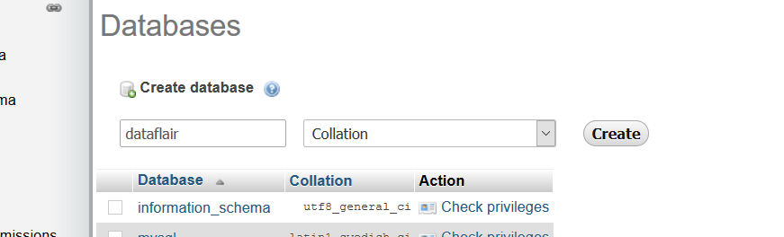

#############   
Configuración
#############

Los nombres de algunos archivos y directorios son muy importantes para Django. No debemos renombrar los archivos. Moverlos a un lugar diferente tampoco es buena idea. Django necesita mantener una cierta estructura para poder encontrar cosas importantes.

.. note::

   Recordemos ejecutar todo en el ``virtualenv``. Si no vemos un prefijo :mod:`(costosbocadilloenv)` en nuestra consola tenemos que activar nuetro ``virtualenv``. Explicamos cómo hacerlo en el capítulo de **Instalación de Django** en la sección **Trabajar con virtualenv**. Basta con escribir ``costosbocadilloenv\Scripts\activate``

.. important::

   Esta documentación se basa en código ya creado y depurado, así que no es necesario instalar Django a menos que se quiera crear un proyecto nuevo.  
   
Para crear un nuevo proyecto debemos ejecutar el siguiente comando::

       > (costosbocadilloenv) django-admin.exe startproject mysite
       
Donde :mod:`mysite` será el nombre de nuestro proyecto.

``django-admin.py`` es un script que creará los archivos y directorios para nosotros. Como mencionamos anteriormente, esta documentación se basa en código ya desarrollado así que obviamente habrán mas archivos y directorios que al crear un proyecto nuevo. Ahora deberíamos tener una estructura de directorios parecida a esta:  

.. code:: 
   
   CostosBocadillo
   ├─── apps
   ├─── templates
   ├─── static
   ├─── manage.py
   ├─── costosbocadillo
                     ├─── settings.py
                     ├─── urls.py
                     ├─── wsgi.py
                     ├─── __init__.py

*  ``manage.py`` es un script que ayuda con la administración del sitio. Con él podremos iniciar un servidor web en nuestro ordenador sin necesidad de instalar nada más, entre otras cosas.

* El archivo ``settings.py`` contiene la configuración de nuestro sitio web.

* ``urls.py`` contiene una lista de los patrones utilizados por ``urlresolver``.

Por ahora vamos a ignorar el resto de archivos porque no los vamos a cambiar

   
Cambiar la configuración
************************

Vamos a hacer algunos cambios en :mod:`costosbocadillo/settings.py`. Abre el archivo usando el editor de código que has instalado anteriormente.

Sería bueno tener el horario correcto en nuestro sitio web. En ``settings.py``, encuentraremos la línea que contiene ``TIME_ZONE`` y modifícala para elegir tu zona horaria.

.. code:: 
   
   TIME_ZONE = 'UTC'

Un código de idioma tiene dos partes: el idioma, p.ej. ``en`` para inglés o ``de`` para alemán, y el código de país, p.ej. ``de`` para Alemania o ``ch`` para Suiza. Si nuestro idioma nativo no es el inglés, podemos añadir lo siguiente para cambiar el idioma de los botones y notificaciones de Django. Así tendremos el botón **Cancel** traducido al idioma que pongamos aquí. `Django viene con muchas traducciones preparadas <https://docs.djangoproject.com/en/2.2/ref/settings/#language-code>`_. Si queremos un idioma diferente, cambiaremos el código de idioma, cambiando la siguiente línea:

.. code:: 
   
   LANGUAGE_CODE = 'es-co'
   
   
También tenemos que añadir una ruta para archivos estáticos. Esta ruta ya está agregada en nuestro proyecto. En caso de que no esté, iremos al final del archivo, y justo debajo de la entrada ``STATIC_URL``, añadiremos una entrada nueva llamada ``STATIC_ROOT``:

.. code::  

   STATIC_URL = '/static/'
   STATICFILES_DIRS = ( os.path.join(BASE_DIR, 'static') )
   
   
Cuando :mod:`DEBUG` es ``True`` y :mod:`ALLOWED_HOST` esta vacío, el host es validado contra ``['localhost', '127,0.0.1', '[::1]']``. Una vez despleguemos nuestra aplicación cambiar esto. En este caso ya esta configurado para el dominio costosbocadillo.com.

.. code::  
   
   ALLOWED_HOSTS = ['165.22.186.6', 'costosbocadillo.com', '127.0.0.1']
   
   
Además, observemos que la configuración de ``INSTALLED_APPS`` se encuentra en la parte superior del archivo. Esta contiene los nombres de todas las aplicaciones Django que están activadas en esta instancia de Django. Las aplicaciones se pueden usar en diversos proyectos y las podemos empaquetar y distribuirlas para que otras personas las puedan utilizar en sus proyectos.
Por defecto, ``INSTALLED_APPS`` contiene las siguientes aplicaciones y Django viene equipado con todas ellas:

.. code-block:: python

   'django.contrib.admin'          # El sitio administrativo. Usted lo utilizará dentro de poco.
   'django.contrib.auth'           # Un sistema de autenticación.
   'django.contrib.contenttypes'   # Un framework para los tipos de contenido.
   'django.contrib.sessions'       # Un framework de sesión.
   'django.contrib.messages'       # Un framework de mensajería.
   'django.contrib.staticfiles'    # Un framework para la gestión de archivos estáticos.

.. note::

   Algunas de estas aplicaciones utilizan al menos una tabla de base de datos, por lo que necesitamos crear las tablas en la base de datos antes de poder utilizarlas. Para ello, ejecutaremos los siguientes comandos::

          > 1. python manage.py makemigrations
          > 2. python manage.py migrate
          
   Pero esto lo aremos más adelante cuando hayamos creado y conectado la base de datos. 
      
Conexión de la base de datos MySQL
**********************************  

MySQL es una base de datos muy poderosa que le brinda toneladas de características y flexibilidad.

Estos son los pasos para integrar el proyecto Django con MySQL:

Instalar Xampp
--------------

Xampp es una herramienta gratuita de código abierto que le proporciona el servidor Apache y phpMyAdmin, que es la mejor fuente para que los programadores principiantes trabajen con MySQL.

:1: Ejecute el panel de control de Xampp. Ahora, después de la instalación, deberá ejecutar el Panel de control de Xampp e iniciar 2 servicios allí, :mod:`Apache` y :mod:`MySQL`.

.. image:: ../_static/xampp.png

Simplemente haga clic en la acción de inicio, y después de comenzar debería verse como esta imagen.

.. image:: ../_static/xamm2.png

Ahora, haga clic en el Administrador del Servicio MySQL, que debería abrir una página web (sin conexión) con este aspecto.

:2: Crear una base de datos SQL. En la página web phpMyAdmin, tendremos que crear una base de datos para nuestro proyecto. 

Simplemente haga clic en el botón Nuevo como se muestra aquí. Luego, simplemente complete el nombre deseado de su base de datos y haga clic en el botón Crear

Eso agregará su base de datos en la lista.

.. image:: ../_static/crear3.png

Eso es todo, ahora no necesitamos hacer nada aquí. Solo interactuaremos con python y el **componente de modelos de Django** preparará todo para nosotros.

.. image:: ../_static/crear4.png

La base de datos que creamos está vacía en este momento. Después del tercer paso, habrá muchas tablas con información diferente.

:3: En este último paso, cambiaremos el diccionario *BASE DE DATOS* en la configuración de nuestros proyectos :mod:`principales.py`.

Primero, instalaremos este archivo a través de la línea de comando::

       > 1. pip install cymysql
       > 2. pip install django-cymysql
       

Esto instalará el código Django para conectar la base de datos MySQL.
   
      

Configurar una base de datos
****************************

Hay una gran variedad de opciones de bases de datos para almacenar los datos de nuestro sitio. Para este proyecto utilizamos *MySQL*. La conexión ya esta configurada de la siguiente forma:

.. code::

   if DEBUG:
    DATABASES = {
        'default': { 
            'ENGINE': 'mysql_cymysql', #Conexión a mysql
            'NAME': 'cb_django',
            'HOST': '127.0.0.1',
            'USER': 'root',
            'PASSWORD': '',
            'PORT': 3306
        }
    }

El motor ``ENGINE`` aquí es ``mysql_cymysql`` que, como su nombre indica, es una biblioteca de Python para MySQL.

``NAME`` es el nombre de la base de datos de MySQL.

``USER`` es el usuario de nuestra base de datos, si no tiene, por defecto es ``root``.

Aquí, el ``HOST`` es el servidor host, pero si se deja en blanco significa que, por defecto, es localhost.

URLs
****

Una URL es una dirección de la web. Podemos ver una URL cada vez que visitamos una página. Se ve en la barra de direcciones del navegador. Por ejemplo :mod:`127.0.0.1:8000` es una URL y :mod:`https://costosbocadillo.com` también es una URL.

Cada página en Internet necesita su propia URL. De esta manera nuestra aplicación sabe lo que debe mostrar a un usuario que abre una URL. En Django utilizamos algo que se llama ``URLconf`` . *URLconf* es un conjunto de patrones que Django intentará comparar con la URL recibida para encontrar la vista correcta.

:¿Cómo funcionan las URLs en Django?: Vamos a abrir el archivo :mod:`costosbocadillo/urls.py` veamos lo que tiene:

.. code-block:: python
  :emphasize-lines: 9
  
   """costosbocadillo URL Configuration

   [...]
   """
   from django.contrib import admin
   from django.urls import path

   urlpatterns = [
    path('admin/', admin.site.urls),
   ]
   
Esta línea dice que para cada URL que empieza con :mod:`admin/` Django encontrará su correspondiente ``view``. En este caso estamos incluyendo muchas URLs admin así que no todo está empaquetado en este pequeño archivo. Es más limpio y legible.

   
Views
*****

Una View es un lugar donde ponemos la *lógica* de nuestra aplicación. Pedirá información del modelo que hemos creado antes y se la pasará a la *plantilla*. Crearemos una plantilla más adelante.

En este caso crearemos una clase para que nuestro proyecto renderice una vista principal cada vez que ejecutemos el servidor. Para esto debemos importar la librería ``TemplateView`` de Django y el ``HttpResponse``.

.. code-block:: python
  :emphasize-lines: 2,3,5,6
  
   from django.shortcuts import render
   from django.http import HttpResponse
   from django.views.generic import TemplateView
   
   class index(TemplateView):
    template_name = "index.html"
    
    
Crear una aplicación
********************

Para mantener todo en orden, crearemos una aplicación separada dentro de nuestro proyecto. Es muy bueno tener todo organizado desde el principio. Para crear una aplicación, necesitamos ejecutar el siguiente comando en la consola dentro de la carpeta de CostosBocadillo, donde está el archivo :mod:`manage.py`. Debemos crear un directorio llamado :mod:`apps` o con el nombre que queramos y dentro de esta crearemos todas la aplicaciones que necesitemos::

       > 1. mkdir apps
       > 2. cd apps
       > 3. python manage.py startapp post

Donde ``post`` es el nombre que le pondremos a nuestra aplicación.

Después de crear una aplicación, también necesitamos decirle a Django que debe utilizarla. Eso se hace en el fichero :mod:`costosbocadillo/settings.py`. Tenemos que encontrar ``INSTALLED_APPS`` y agregar una línea que contiene ``'apps.post'``, justo por encima de ``]``. El producto final debe tener este aspecto:

.. code-block:: python
  :emphasize-lines: 8
  
   INSTALLED_APPS = [
       'django.contrib.admin',
       'django.contrib.auth',
       'django.contrib.contenttypes',
       'django.contrib.sessions',
       'django.contrib.messages',
       'django.contrib.staticfiles',
       'apps.post',
   ]

Crear el modelo
***************

En el archivo :mod:`name/models.py` definimos todos los objetos llamados ``Models``. Este es un lugar en el cual definiremos nuestra entrada del :mod:`post`.

Abrimos :mod:`post/models.py` en el editor, borramos todo, y escribiremos código como este:

.. code-block:: python
   
   from django.db import models
   from django.utils import timezone

   class Post(models.Model):
       author = models.ForeignKey('auth.User', on_delete=models.CASCADE)
       title = models.CharField(max_length=200)
       text = models.TextField()
       created_date = models.DateTimeField(
               default=timezone.now)
       published_date = models.DateTimeField(
            blank=True, null=True)

       def __str__(self):
           return self.title
           
Todas las líneas que comienzan con ``from`` o ``import`` son líneas para agregar algo de otros archivos. Así que en vez de copiar y pegar las mismas cosas en cada archivo, podemos incluir algunas partes con ``from... import ...``.

``class Post(models.Model):``, esta línea define nuestro modelo (es un objeto).

	* ``class`` es una palabra clave que indica que estamos definiendo un objeto.
	* ``Post`` es el nombre de nuestro modelo. Podemos darle un nombre diferente (pero debemos evitar espacios en blanco y caracteres especiales). ***Siempre inicia*** el nombre de una clase con una letra mayúscula.
	* ``models.Model`` significa que Post es un modelo de Django, así Django sabe que debe guardarlo en la base de datos.

Ahora definimos las propiedades: ``title``, ``text``, ``created_date``, ``published_date`` y ``author``. Para ello tenemos que definir el tipo de cada campo. 

	* ``models.CharField``, así es como definimos un texto con un número limitado de caracteres.
	* ``models.TextField``, este es para texto largo sin límite.
	* ``models.DateTimeField``, este es fecha y hora.
	* ``modelos.ForeignKey``, este es una relación (link) con otro modelo.
    
No vamos a explicar cada pedacito de código porque nos tomaría demasiado tiempo. Debemos echar un vistazo a la documentación de Django si deseas obtener más información sobre los campos Modelo y cómo definir otras cosas distintas a las descritas anteriormente https://docs.djangoproject.com/en/2.2/ref/models/fields/#field-types.

Crear tablas para los modelos en tu base de datos
-------------------------------------------------

El último paso aquí es agregar nuestro nuevo modelo a la base de datos. Primero tenemos que hacer saber a Django que hemos hecho cambios en nuestro modelo.Ve a tu terminal y escribe ``python manage.py makemigrations``. Se verá así::

       > python manage.py makemigrations
       
.. note::
   
   Recuerda guardar los archivos que edites. De otro modo, nuestro computador ejecutará las versiones anteriores lo que puede ocasionar errores inesperados.
   
Django preparó un archivo de migración que ahora tenemos que aplicar a nuestra base de datos. Escribe ``python manage.py migrate`` y el resultado debería ser::

       > (costosbocadilloenv) python manage.py migrate
           Operations to perform:
            Apply all migrations: post
           Running migrations:
            Applying blog.0001_initial... OK